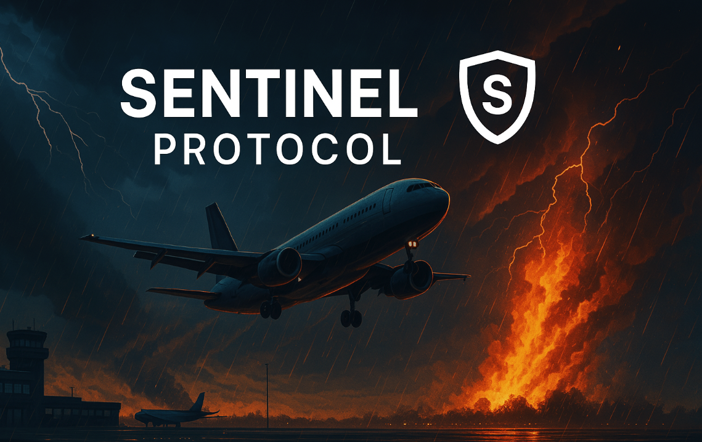

# Sentinel Protocol

## Submission Title 
Parametric Insurance Framework and Flight Insurance Beta Launch

## One Sentence Description: (130 characteres)
Parametric insurance framework for any risk market with reliable oracles to automate payouts with smart contracts.

## Project URL:
https://sentinel-finance.vercel.app/

## Code URL: 
https://github.com/SentinelFi#-sentinel-protocol-repositories

## Video URL: * (3 min)

## Products & Services

**Sentinel Protocol** is a parametric insurance framework built on the **Soroban blockchain**. It is designed to provide trustless, automated, and transparent coverage for real-world risk markets. The protocol connects individuals seeking protection with DeFi investors who underwrite risk in exchange for yield, using smart contracts and decentralized oracles to automate claims and remove intermediaries. Traditional insurance is often opaque and slow, with manual processes and unclear terms. Sentinel solves this by making every step from policy creation to payout fully transparent, data-driven, and executed on-chain without the need for intermediaries or administrative overhead.

The protocol is modular and supports any risk vertical where reliable oracle data is available—such as flight delays, wildfires, or weather events. Claims are executed automatically through Soroban contracts based on real-world data, ensuring fairness and speed for both users and underwriters.

Our first insurance vertical is **Flight Delay Insurance**, which pays users automatically if their flight is delayed beyond a defined threshold (e.g., 6 hours). This product will launch on **Testnet**, followed by a **Closed Beta on Mainnet**. It features a user-friendly UI for travelers to easily purchase coverage, and a dashboard for risk vault investors to underwrite policies and earn yield. The beta will be open to community members for testing before the full public release.

We got our start with the **Kickstart Grant**, where we built and validated the early foundations of **Sentinel Protocol**. While we’ve made strong progress, there’s still a lot of work ahead. You can find a detailed overview of what we’ve accomplished so far, and what we plan to build next, in the [Technical section](https://github.com/SentinelFi/build_35_submission/blob/main/technical.md).

Built natively on Soroban, Sentinel Protocol uses:
- **Soroban Smart Contracts** to automate all core operations including deposits, claims, and payouts.
- **Acurast Trusted Execution Environment (TEE)** to deliver real-time, tamper-resistant data to the blockchain.
- **Stellar SDKs** are used to connect **liquidation bots** and **keepers** that advance the protocol's state and coordinate interactions seamlessly.

We are open-sourcing the entire Sentinel Protocol framework and contributing reusable components to the broader Soroban developer community. These include modular vault standards inspired by ERC-4626, oracle pipelines to connect Web2 data to Soroban in a trust-minimized way, and liquidation bots and keepers to manage automated operations. We’re also releasing comprehensive documentation, tutorials, and videos to support developers who want to build with Sentinel or extend its components for other DeFi applications.

The framework itself is designed to be adaptable and reusable, making it easy to launch new parametric insurance products across different risk markets. Our goal is to help disrupt the opaque and outdated insurance industry, and we actively encourage other developers to build their own parametric insurance protocols on top of Sentinel.

In short, Sentinel Protocol provides the following: 

- For the developer community:
  - A reusable ERC-4626-style vault standard for any DeFi project on Soroban
  - Oracle integration using Acurast TEE to securely fetch Web2 API data
    - Among the first implementations bringing Acurast to Soroban
    -  Expands oracle capabilities beyond on-chain asset prices (e.g. flight data, fire zones)
  - Example liquidation bots and keepers to automate contract state progression
  - Full developer support with documentation, tutorials, and example integrations

- For DeFi yield seekers:
  - Earn yield by underwriting real-world risks
  - Transparent vaults with automated payouts
  - Uncorrelated returns tied to actual insurance demand

- For insurance buyers:
  - Easy-to-use UI to purchase protection
  - Instant, automated payouts triggered by real data
  - No middlemen, claims, or delays

## Traction Evidence: 

Since receiving the Kickstart Grant, we’ve made meaningful technical progress on the Sentinel Protocol framework, laying the foundation for decentralized parametric insurance on Soroban. Highlights include:

- Implementation of our ERC-4626-style vault standard, designed for modular use across DeFi applications. [View the repo](#)
- Ongoing work to integrate the vault standard as an extension of OpenZeppelin’s token library on Soroban, in collaboration with the OpenZeppelin team. [Discussion or PR link](#)
- Integration of Acurast TEE with Soroban, enabling secure and trust-minimized access to Web2 data. [Integration code or repo](#)
- A published guide detailing the Acurast-Soroban integration process. [Read the article](#)

On the insurance front, we’ve made strong progress validating real use cases and building functional prototypes:

- A working **Flight Delay Insurance UI** is live and ready for testing. [View UI](#)
- We’ve also built a **Fire Insurance prototype** for the Build on Stellar Hackathon, using NASA’s FIRMS API and satellite fire data. This demonstrates that with a reliable oracle, we can launch effective parametric insurance products across multiple verticals. [Project link](#)
- We’re currently in conversations with two other teams interested in building on our framework:
  - One of them is building **crop insurance** for weather-related risks in Africa and applying to the next Kickstart round. [Team/project link](#)
- Additionally, we conducted **over a dozen user interviews** during ETHDenver 2025 with both insurance buyers and DeFi yield providers, helping us validate product-market fit across both user groups.

We also performed **preliminary Monte Carlo simulations** to explore sustainable yield generation for counterparty investors:
  - For **Flight Insurance**, simulations show a median yield of **50%** with a 3-hour delay threshold and flight delay probabilities ranging from 1% to 10%.
  - For **Fire Insurance**, simulations show a median yield of **50–220%** in areas with prior wildfire activity, assuming wildfire probabilities between **0.3% and 1.7%**. [Yield analysis](#)

With the **Build Award**, we aim to go beyond the developer and infrastructure side and focus on bringing real users into the ecosystem. This includes both **insurance buyers** and **counterparty investors**, helping us test live risk markets and validate sustainable yield at scale.

## Technical Architecture

https://github.com/SentinelFi/build_35_submission/blob/main/technical.md

## Thumbnail: 

## SCF Build Tranche Deliverables

### Tranche 1 - MVP: *
### Tranche 2 - Testnet: *
### Tranche 1 - Mainnet: *

## Budget

## Go to Market 

## Success Criteria: *

## Reference 

N/A 