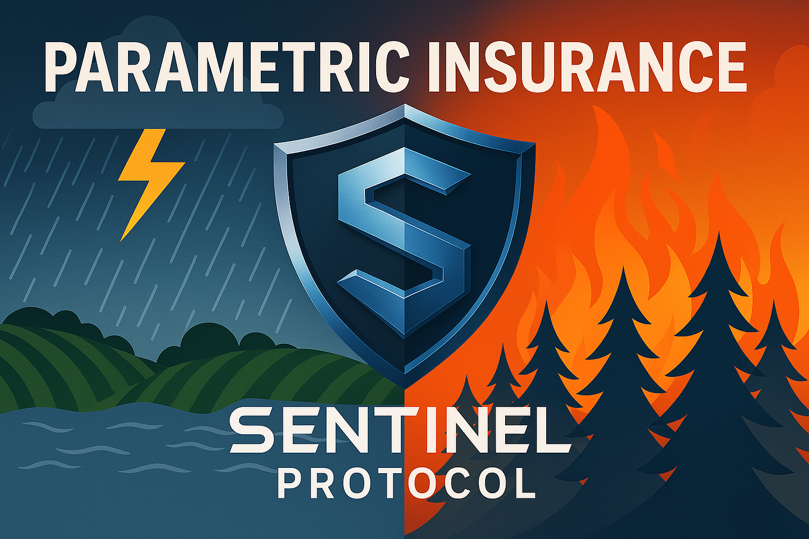

# Sentinel Protocol

## Submission Title 
Parametric Insurance Framework and Flight Insurance Beta Launch

## One Sentence Description: (130 characteres)
Parametric insurance framework for any risk market with reliable oracles to automate payouts with smart contracts.

## Project URL:
https://sentinel-finance.vercel.app/

## Code URL: 
https://github.com/SentinelFi#-sentinel-protocol-repositories

## Video URL: * (3 min)

## Products & Services

**Sentinel Protocol** is a parametric insurance framework built on the **Soroban blockchain**. It is designed to provide trustless, automated, and transparent coverage for real-world risk markets. The protocol connects individuals seeking protection with DeFi investors who underwrite risk in exchange for yield, using smart contracts and decentralized oracles to automate claims and remove intermediaries. Traditional insurance is often opaque and slow, with manual processes and unclear terms. Sentinel solves this by making every step from policy creation to payout fully transparent, data-driven, and executed on-chain without the need for intermediaries or administrative overhead.

The protocol is modular and supports any risk vertical where reliable oracle data is available—such as flight delays, wildfires, or weather events. Claims are executed automatically through Soroban contracts based on real-world data, ensuring fairness and speed for both users and underwriters.

Our first insurance vertical is **Flight Delay Insurance**, which pays users automatically if their flight is delayed beyond a defined threshold (e.g., 6 hours). This product will launch on **Testnet**, followed by a **Closed Beta on Mainnet**. It features a user-friendly UI for travelers to easily purchase coverage, and a dashboard for risk vault investors to underwrite policies and earn yield. The beta will be open to community members for testing before the full public release.

We got our start with the **Kickstart Grant**, where we built and validated the early foundations of **Sentinel Protocol**. While we’ve made strong progress, there’s still a lot of work ahead. You can find a detailed overview of what we’ve accomplished so far, and what we plan to build next, in the [Technical section](https://github.com/SentinelFi/build_35_submission/blob/main/technical.md).

Built natively on Soroban, Sentinel Protocol uses:
- **Soroban Smart Contracts** to automate all core operations including deposits, claims, and payouts.
- **Acurast Trusted Execution Environment (TEE)** to deliver real-time, tamper-resistant data to the blockchain.
- **Stellar SDKs** are used to connect **liquidation bots** and **keepers** that advance the protocol's state and coordinate interactions seamlessly.

We are open-sourcing the entire Sentinel Protocol framework and contributing reusable components to the broader Soroban developer community. These include modular vault standards inspired by ERC-4626, oracle pipelines to connect Web2 data to Soroban in a trust-minimized way, and liquidation bots and keepers to manage automated operations. We’re also releasing comprehensive documentation, tutorials, and videos to support developers who want to build with Sentinel or extend its components for other DeFi applications.

The framework itself is designed to be adaptable and reusable, making it easy to launch new parametric insurance products across different risk markets. Our goal is to help disrupt the opaque and outdated insurance industry, and we actively encourage other developers to build their own parametric insurance protocols on top of Sentinel.

In short, Sentinel Protocol provides the following: 

- For the developer community:
  - A reusable ERC-4626-style vault standard for any DeFi project on Soroban
  - Oracle integration using Acurast TEE to securely fetch Web2 API data
    - Among the first implementations bringing Acurast to Soroban
    -  Expands oracle capabilities beyond on-chain asset prices (e.g. flight data, fire zones)
  - Example liquidation bots and keepers to automate contract state progression
  - Full developer support with documentation, tutorials, and example integrations

- For DeFi yield seekers:
  - Earn yield by underwriting real-world risks
  - Transparent vaults with automated payouts
  - Uncorrelated returns tied to actual insurance demand

- For insurance buyers:
  - Easy-to-use UI to purchase protection
  - Instant, automated payouts triggered by real data
  - No middlemen, claims, or delays

## Traction Evidence: 

Since receiving the Kickstart Grant, we’ve made meaningful technical progress on the Sentinel Protocol framework, laying the foundation for decentralized parametric insurance on Soroban. Highlights include:

- Implementation of our ERC-4626-style vault standard, designed for modular use across DeFi applications. [View the repo](#)
- Ongoing work to integrate the vault standard as an extension of OpenZeppelin’s token library on Soroban, in collaboration with the OpenZeppelin team. [Discussion or PR link](#)
- Integration of Acurast TEE with Soroban, enabling secure and trust-minimized access to Web2 data. [Integration code or repo](#)
- A published guide detailing the Acurast-Soroban integration process. [Read the article](#)

On the insurance front, we’ve made strong progress validating real use cases and building functional prototypes:

- A working **Flight Delay Insurance UI** is live and ready for testing. [View UI](#)
- We’ve also built a **Fire Insurance prototype** for the Build on Stellar Hackathon, using NASA’s FIRMS API and satellite fire data. This demonstrates that with a reliable oracle, we can launch effective parametric insurance products across multiple verticals. [Project link](#)
- We’re currently in conversations with two other teams interested in building on our framework:
  - One of them is building **crop insurance** for weather-related risks in Africa and applying to the next Kickstart round. [Team/project link](#)
- Additionally, we conducted **over a dozen user interviews** during ETHDenver 2025 with both insurance buyers and DeFi yield providers, helping us validate product-market fit across both user groups.

We also performed **preliminary Monte Carlo simulations** to explore sustainable yield generation for counterparty investors:
  - For **Flight Insurance**, simulations show a median yield of **50%** with a 3-hour delay threshold and flight delay probabilities ranging from 1% to 10%.
  - For **Fire Insurance**, simulations show a median yield of **50–220%** in areas with prior wildfire activity, assuming wildfire probabilities between **0.3% and 1.7%**. [Yield analysis](#)

With the **Build Award**, we aim to go beyond the developer and infrastructure side and focus on bringing real users into the ecosystem. This includes both **insurance buyers** and **counterparty investors**, helping us test live risk markets and validate sustainable yield at scale.

## Technical Architecture

https://github.com/SentinelFi/build_35_submission/blob/main/technical.md

## Thumbnail: 

## SCF Build Tranche Deliverables

### Tranche 1 – MVP *
**Total Budget:** $48,800  

#### 1. Smart Contract & Architecture Changes – $19,200

- Implement the **Central Risk Vault Architecture**, replacing per-market risk vaults with a single pooled vault that supports multiple Hedge Vaults, improving capital efficiency and investor exposure.  [More in our technical documentation](#)

- Re-evaluate the **Hedge Vault design** to explore enhancements like dynamic pricing or pooled buyer tranches, aimed at optimizing capital use and user experience for insurance buyers.  

- **Timeline:** 5-6 weeks after receiving funds  

- **Completion Criteria:**  The new Controller contract and Market Maker have been deployed. New markets are now being created with individual Hedge Vaults, all connected to a single, centralized Risk Vault. The architecture is currently passing internal tests.

#### 2. Purpose-Built Flight Delay Insurance Interface – $22,400  
- **Timeline:** 7-8 weeks after receiving funds  
- **Completion Criteria:** The UI for Flight Delay Insurance has been fully redesigned, moving away from a generalized Hedge/Risk Market interface to a purpose-built experience. Insurance Buyers and Risk Investors now have dedicated dashboards, offering intuitive deposit and withdrawal flows for investors, and a streamlined coverage purchase flow for buyers. Liquidation events and oracle-triggered data are clearly displayed, enhancing transparency across the system.

#### 3. Vault Standardization – $4,800
- Finalize our internally complete Vault logic for external adoption, including documentation, usage examples, and a developer-facing article to support broader integration across the Soroban ecosystem.
- Submit the contract to the OpenZeppelin Soroban Contracts library as a reusable DeFi primitive. ( We already started the process)
- Propose the Vault as a Soroban Ecosystem Proposal (SEP) on the Standards track for potential endorsement by the Stellar Development Foundation (SDF).

- **Timeline:** 7-8 weeks after receiving funds  

- **Completion Criteria:** Deployed contract, full documentation, and integration example and developer facing article.

*Note: Timelines for OpenZeppelin and SDF endorsement are external and not under our control, but we will align with their guidelines and contribute actively.*

#### 4. Acurast Oracle Integration - $2,400 
- A key innovation from our Kickstarter phase was integrating **Acurast Oracles** with Soroban using **Trusted Execution Environments (TEEs)**. Unlike EVM ecosystems that offer solutions like Chainlink Functions, Soroban lacks native support for fetching Web2 data on-chain—this integration offers a viable alternative. As part of this milestone, we will publish documentation, example contracts, and a technical article to help developers bring verifiable Web2 API data into their Soroban smart contracts using Acurast.

- **Timeline:** 2-3 weeks after receiving funds  

- **Completion Criteria:** Full documentation, and integration example and developer facing article.

### Tranche 2 – Testnet  
**Total Budget:** $48,000  

#### 1. Oracle Infrastructure Update – $19,200

- Deploy a **Flight Data Aggregator Contract** to decouple data ingestion from the Controller, enabling scalable and reusable oracle feeds.

- Set up an **Acurast TEE script** to fetch flight data of many flights and push updates to the aggregator, allowing Sentinel contracts to query flight status asynchronously for improved efficiency.  [More in our technical documentation](#)

- **Timeline:** 14 -15 weeks after receiving funds 

- **Completion Criteria:** A deployed contract that reliably holds aggregated flight data, with a modular pipeline in place that supports scalable integration of additional flight routes for future insurance markets.

#### 2. Automate Market Creation – $16,000  

- Implement logic to auto-deploy a new **Hedge Vault** when a user initiates coverage for a tracked flight, register it with the **Controller Contract**, and link it to the shared **Central Risk Vault**—enabling parallel, scalable insurance markets with minimal manual setup.  

- Integrate this flow with the existing UI and build a **webhook trigger** that creates new markets in real-time as users purchase coverage.

- **Timeline:** 12–13 weeks after receiving funds  
Deploy a permissionless **Vault Factory Contract** to allow anyone to launch Hedge Vaults linked to the central Risk Vault.

- **Completion Criteria:** A new Hedge Vault is automatically deployed, registered, and linked to the Central Risk Vault upon user purchase, with the process fully integrated into the UI and triggered via webhook.

#### 3. Testnet Launch & E2E Testing – $12,800

- Deploy the full Sentinel Protocol stack to testnet and perform **manual end-to-end testing via the UI**, including vault interactions, oracle events, and claim flows.  

- Build and execute an **automated E2E test suite** covering deposits, withdrawals, oracle updates, payouts, and liquidation logic across key user scenarios.

- **Timeline:** 15-16 weeks after receiving funds  

- **Completion Criteria:**  Full protocol deployed on testnet with manual testing verified through the UI and an automated E2E test suite executed covering all critical flows, confirming system readiness for mainnet.

### Tranche 3 – Mainnet
**Total Budget:** $41,600

#### 1. Liquidation and Keeper Bots – $12,800

- Develop an open-source **Liquidation Bot**, including a working example that anyone can run to monitor oracle data and trigger claims. [More in our technical documentation](#)

- Add Protocol level incentives for people tp run these bots.

* Explore decentralized automation using **Acurast TEEs** to replace centralized cron jobs with trust-minimized, off-chain keepers.

- **Timeline:** 19-20 weeks after receiving funds  

- **Completion Criteria:**  - Automation flows no longer depend on centralized cron jobs, with at least one open-source bot live on testnet and Acurast-based keeper integration validated.

#### 2. Yield Study – $12,800 
- Expand our preliminary Monte Carlo simulation into a deeper study using real flight delay data from FlightAware and similar sources to assess vault profitability and capital efficiency.  

-  Analyze high-traffic routes within the continental US to identify promising markets for insurance, estimating coverage amounts, expected payouts, and premium pricing based on delay frequency and passenger volume.

 - **Timeline:** 9–10 weeks after receiving funds  

- **Completion Criteria:**  We will produce a detailed analysis including median expected yield projections and identify at least **50 insurable routes** with recommended coverage and pricing parameters.

#### 3. Mainnet Launch (Closed Beta) and Audit Pass Work – $16,000 
- Conduct pre-audit reviews and internal security testing to prepare the Sentinel contracts for a professional third-party audit.  
- Pass safety Audits with help from Stellar Launchkit.
-  Address and implement all audit findings, update documentation, and finalize deployment configurations to prepare for mainnet launch. 
- **Timeline:** 6 months after receiving funds  

- **Completion Criteria:** We will successfully pass the audit with support from **Stellar LaunchKit**, having resolved all critical and high-risk issues. We also would have deployed all our contract on Mainnet and have launched a Clsoed Beta.

*Note: The budget hereto meet audit standards (not the audit cost itself), it is also to fix audit issues as the arise*

## Budget
138,400

## Go to Market 

We have an ambitious goal: to disrupt the parametric insurance market by leveraging **Soroban** to bring transparency, automation, and trustless execution to an industry that remains opaque and slow. While six months and a limited budget are not enough to realize the full vision, this phase gives us a strong foundation to prove product-market fit, engage early partners, and demonstrate the viability of on-chain insurance.

 As we move forward, we are laying out the next evolution of the Sentinel framework and developing clear strategies to capture market share across high-impact insurance verticals.

### 🛠️ Future Plans for the Framework

* Integrate Reclaim Protocol or similar zkTLS frameworks to enable zero-knowledge proofs of personhood and actions like flight ticket purchases. 

* Join accelerators like Draper University, Tachyon, or a16z Crypto Startup School to raise funding, expand our network, and grow the team.

* Explore additional TEE platforms like Phala Network and Lit Protocol to ensure flexibility and long-term reliability beyond Acurast.

* Build a more resilient Oracle layer by averaging data from multiple APIs to improve accuracy and reduce dependency on single sources.

* Six months is not enough to deliver the full vision; we plan to return in the Growth phase or a future Build Award to continue building insurance on Soroban at scale. 

### 📈 Ideas to Capture Market Share

* Target flight insurance for major crypto events like Token2049, ETHDenver, and Devcon—where crypto-native travelers are highly concentrated. Explore partnerships with ETHGlobal to include our coverage in their “Hacker Pack” or “City Pack” offerings.

* Form partnerships with travel platforms like Expedia to offer flight delay and weather-proof vacation insurance directly to travelers at the point of booking.

* Initially, launch our own Chrome extension to bypass partnership dependencies and directly offer users flight and weather insurance, with built-in incentives to encourage adoption.

* Position Sentinel as the default backend for on-chain insurance startups by offering plug-and-play tooling to launch new markets. Sponsor hackathons to encourage teams to build insurance products on top of our framework.

* After the Closed Beta launch, host regular X Spaces and grow a vibrant Discord community to drive awareness, onboard users, and engage DeFi-native participants interested in underwriting risk.

* Launch domain-specific verticals (e.g. wildfire protection in California, hail damage in the Midwest) based on real-world demand and high-risk conditions.

* Partner with influencers and climate advocacy groups to raise awareness and drive adoption of insurance products targeting climate-related risks and extreme weather events.*

* Offer capital incentives to early insurance underwriters, particularly in new markets with high yield potential.

* Develop tailored onboarding flows and educational content for specific user segments (e.g., small farmers, remote workers, frequent flyers).

## Success Criteria: 
- Flight Delay Insurance is live as a Closed Beta on Soroban mainnet, built on top of Sentinel Protocol—an on-chain, trustless, and automated parametric insurance framework.  
- Investors gain access to real-world asset (RWA) yield opportunities through flight insurance markets, backed by a detailed yield study demonstrating capital sustainability.  
- Developers benefit from a standardized Vault primitive and a modular oracle pipeline for bringing verifiable Web2 non-financial data on-chain via Acurast TEEs.
- The protocol is ready to onboard other teams building insurance products in new verticals, including fire coverage, hail damage, crop yield protection, and earthquake insurance.

## Reference 

N/A 