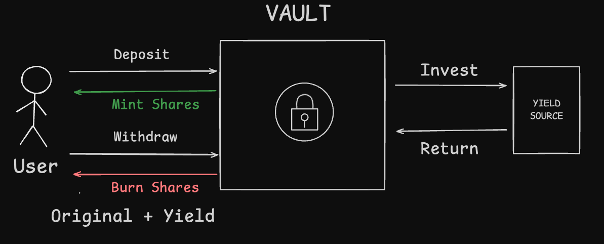
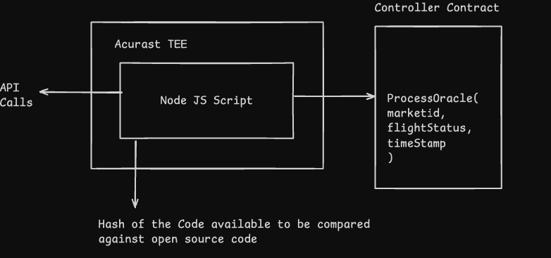
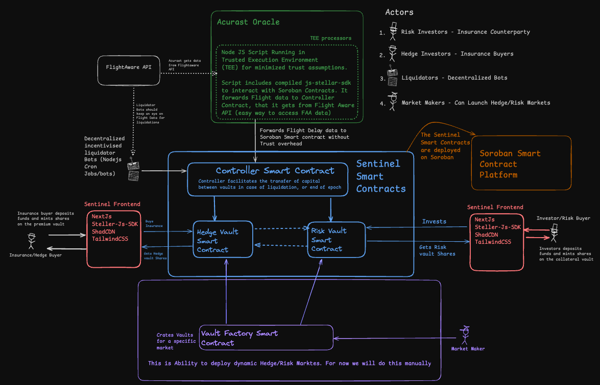

# Technical Architecture

 We're splitting the technical architecture document into two parts:  
 1. **Kickstart Progress** – everything we've accomplished since receiving the Kickstarter award  
 2. **Build Plan** – what we intend to develop once we receive the Build award  

 Feel free to jump to the sections you're most interested in below:

- [Kickstart Phase Progress](#kickstart-phase-progress)
  - [Vault Standard on Soroban](#vault-standard-on-soroban)
  - [Hedge/Risk Market Implementation](#hedgerisk-market-implementation)
  - [Acurast Oracle Integration](#acurast-oracle-integration)
  - [Insurance Use Case: Flight Delay POC](#insurance-use-case-flight-delay-poc)
  - [Hedge Market Frontend](#poc-frontend)
- [Build Phase Plans](#build-phase-additions)

## Kickstarter Phase Progress

After receiving the Kickstarter Grant, we focused on validating the core building blocks required to enable decentralized parametric insurance on Soroban. This phase was centered on proving that each component, such as vaults, controllers, and oracles, could function both independently and together as a system.  
 
As part of this work, we also developed a functional Hedge and Risk Market proof of concept with flight delays, demonstrating that Sentinel Protocol can serve as a strong foundation for building real world risk markets using trust minimized infrastructure.

### 🧱 Vault Standard on Soroban

 A **vault** is a smart contract that securely holds user deposits and automates how those funds are used, often to generate yield or manage risk. The **ERC-4626** standard defines a consistent interface for tokenized vaults that manage yield-bearing assets. It streamlines how users deposit and withdraw funds while allowing protocols to build on top of vaults with predictable behavior and accounting.  

 

We successfully ported the ERC-4626 vault standard, a widely adopted pattern in Ethereum DeFi for managing deposits and yield strategies, to Soroban using Rust-based smart contracts. This implementation is open and modular, allowing anyone to use it as a DeFi primitive within their own protocols.

[View the Vault Repo](https://github.com/SentinelFi/soroban_vault/tree/main/soroban-4626/contracts/vault) to explore the implementation.

### ⚖️ Hedge/Risk Market Implementation

The **Hedge/Risk Market** is built on top of the `ERC-4626` vault primitive we ported to Soroban. This structure enables a decentralized insurance-like system where users can either hedge against specific real-world risks or underwrite those risks in exchange for yield.

At the heart of each market are two vaults:

- A **Hedge Vault** for users seeking protection (insurance buyers)  
- A **Risk Vault** for users willing to take on the risk (risk investors)  

Each vault is deployed as a 1:1 pair for a specific market, and these are automatically created by a **Market Creator Contract**. This contract allows anyone to become a **market maker** by launching a new risk market (e.g. *"Flood in Lagos during August"*). Once deployed, users can begin depositing into either side depending on whether they want to hedge or take risk.

#### 🛠️ How the System Works

- **Hedge Buyers** deposit into the Hedge Vault to protect themselves against a defined event (such as drought or wildfire). If the event occurs, they are compensated.  
- **Risk Investors** deposit into the Risk Vault and earn yield from the premiums paid by hedge buyers. If the event does **not** occur, they keep the yield. If it **does**, their funds are used to pay out claims.  
- A centralized **Controller Contract** monitors all active vaults. It interacts with off-chain oracles (such as Acurast) to verify whether the event occurred. If a payout condition is met, the controller redistributes funds from the Risk Vault to the Hedge Vault.  

### 🌐 Acurast Oracle Integration

A key innovation of our Kickstarter phase was integrating **Acurast Oracles** into Soroban using **Trusted Execution Environments (TEEs)**.

- We wrote a **Node.js script** that runs inside an Acurast TEE processor.
- In our case, the script fetches **flight data** from the [FlightAware API](https://www.flightaware.com/commercial/aeroapi/) and forwards it to our smart contracts using `js-stellar-sdk`.
- To ensure authenticity, the controller only accepts signed messages from a whitelisted oracle address.

This allowed us to forward real-world data into Soroban **securely and without centralized servers**, aligning with the trust-minimization goals of the protocol.

### 🛡️ Insurance Use Case: Flight Delay POC

We combined all the above components into a working **Flight Delay Insurance Proof of Concept**:

- Users deposit funds into Hedge or Risk Vaults to bet on whether a flight will be delayed beyond a fixed threshold (e.g., 3 hours).
- An oracle running on Acurast monitors the flight status and triggers contract logic when a delay is detected.
- If the delay occurs, the Risk Vault is liquidated, and capital flows to the Hedge Vault (paying the insured party).
- If no delay occurs by market maturity, the Hedge Vault’s capital goes to the Risk Vault.

This demonstrated that **parametric insurance** can be implemented on Soroban using decentralized, programmable primitives.

### 🎭 Protocol Actors

The Sentinel Protocol involves four key types of actors who interact with vaults, oracles, and smart contracts to create and operate decentralized hedge and risk markets.

#### 1. Risk Investors (Insurance Counterparties)
These users deposit capital into the Risk Vault to underwrite coverage and earn yield from unclaimed premiums. They take on the financial risk if the insured event occurs.

#### 2. Hedge Buyers (Insurance Buyers)
These users deposit into the Hedge Vault to protect themselves against a predefined real-world event. If the event happens, they receive a payout.

### 3. Liquidators (Decentralized Bots)
Automated bots monitor vaults and oracle feeds to trigger liquidations or claim payouts when conditions are met. They ensure timely execution and enforce protocol rules.

#### 4. Market Makers
Market makers create new risk markets by deploying a pair of Hedge and Risk Vaults through the Vault Factory Contract. This enables permissionless expansion of the protocol.

### 🧪 Manual Market Creation

For the initial Proof of Concept, we **manually deployed** Hedge and Risk Vaults for a single flight delay market. Since the oracle script only includes data for one specific flight (hardcoded into the script running inside the Trusted Execution Environment), each market had to be created manually.

- The **Vault Factory** was not yet implemented, so we handled market creation ourselves.
- The Sentinel team acted as the **market maker**, manually deploying vaults for this flight.

While this setup is not scalable, it was sufficient to validate the end-to-end insurance flow and test how the oracle, controller, and vaults interact in a real scenario.

## 🔗 What’s Next: Build Award Focus

With core components working in isolation and in coordination, we are now focused on the following during the Build Award phase:

TODO!!